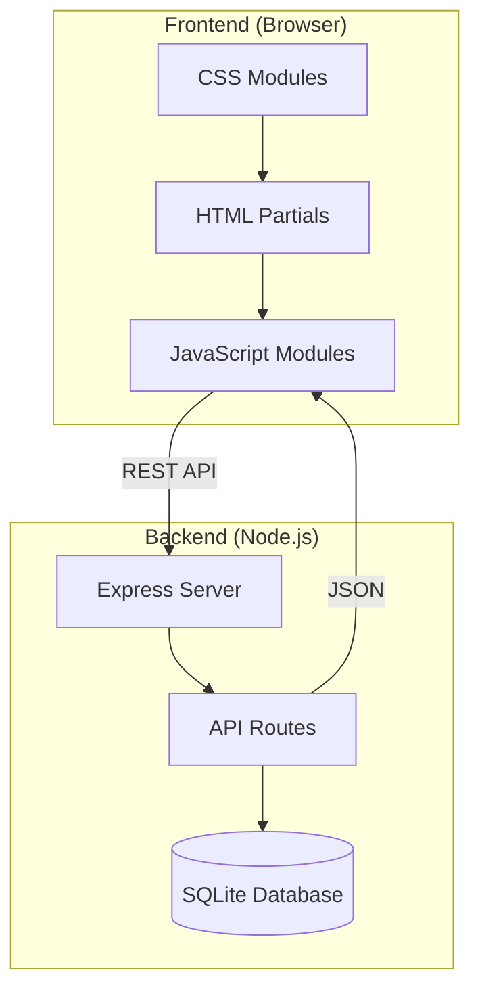

# Technical Proposal

## System Architecture

### Overview

The Internet Shop is a simple web application for managing products. It follows a client-server architecture with a clear separation between frontend and backend.



### Technology Stack

#### Frontend
- **HTML5**: Semantic markup with partials structure
- **CSS3**: Modular CSS with global variables
- **Vanilla JavaScript (ES6+)**: Core JavaScript logic
- **HTMX**: Declarative HTML partials loading and dynamic content updates
- **BEM Methodology**: For all HTML/CSS class naming

#### Backend
- **Node.js**: Runtime environment
- **Express.js**: Web framework for REST API
- **SQLite**: Lightweight database for data persistence

### Frontend Architecture

#### HTML Structure
```
frontend/
├─ index.html              # Main entry point
└─ partials/               # Reusable HTML components
   ├─ header.html          # Site header
   ├─ footer.html          # Site footer
   ├─ product-card.html    # Product card template
   ├─ product-form.html    # Product form template
   └─ product-list.html    # Product list container
```

**Partials Loading**: Partials are loaded dynamically using **HTMX** library with declarative HTML attributes (`hx-get`, `hx-swap`, `hx-trigger`). This provides a cleaner, more maintainable approach compared to manual `fetch()` calls.

#### CSS Architecture
```
frontend/styles/
├─ global.css              # CSS variables (:root) for colors, fonts, spacing
├─ main.css                # Main stylesheet (imports all)
├─ components/             # Component-specific styles
│  ├─ header.css
│  ├─ footer.css
│  ├─ product-card.css
│  ├─ product-form.css
│  └─ product-list.css
└─ utilities.css           # Utility classes (optional)
```

**CSS Variables**: All design tokens (colors, fonts, spacing, etc.) are defined in `global.css` using `:root` selector. All component files reference these variables.

#### JavaScript Modules
```
frontend/scripts/
├─ api.js                  # Backend communication (fetch requests)
├─ products.js             # Business logic (CRUD operations, search, sort)
└─ ui.js                   # DOM manipulation and rendering
```

**Module Responsibilities**:
- `api.js`: Handles all HTTP requests to backend, error handling, LocalStorage fallback
- `products.js`: Product state management, validation, business rules
- `ui.js`: DOM rendering, event handling, user interactions

#### BEM Methodology

All HTML/CSS classes follow BEM (Block Element Modifier) naming:

- **Block**: `.product-card`, `.header`, `.button`
- **Element**: `.product-card__title`, `.product-card__price`
- **Modifier**: `.product-card--featured`, `.button--primary`

Example:
```html
<div class="product-card product-card--featured">
  <h2 class="product-card__title">Product Name</h2>
  <span class="product-card__price">$99.99</span>
</div>
```

### Backend Architecture

#### Server Structure
```
backend/
├─ server.js               # Express server entry point
├─ db.js                   # SQLite database connection and setup
├─ routes/
│  └─ products.js          # Product API endpoints
└─ database.sqlite         # SQLite database file
```

#### Express Server Setup
- Port: 3000 (development)
- CORS enabled for frontend communication
- JSON body parser middleware
- Error handling middleware

### Database Schema

#### Products Table

```sql
CREATE TABLE products (
  id INTEGER PRIMARY KEY AUTOINCREMENT,
  name TEXT NOT NULL,
  price REAL NOT NULL CHECK(price > 0),
  description TEXT,
  createdAt DATETIME DEFAULT CURRENT_TIMESTAMP,
  updatedAt DATETIME DEFAULT CURRENT_TIMESTAMP
);
```

**Fields**:
- `id`: Primary key, auto-increment
- `name`: Product name (required, text)
- `price`: Product price (required, positive number)
- `description`: Product description (optional, text)
- `createdAt`: Creation timestamp
- `updatedAt`: Last update timestamp

### API Specification

#### Base URL
```
http://localhost:3000/api
```

#### Endpoints

##### GET /api/products
Retrieve all products.

**Response**:
```json
{
  "success": true,
  "data": [
    {
      "id": 1,
      "name": "Product Name",
      "price": 99.99,
      "description": "Product description",
      "createdAt": "2024-01-15T10:00:00.000Z",
      "updatedAt": "2024-01-15T10:00:00.000Z"
    }
  ]
}
```

##### POST /api/products
Create a new product.

**Request Body**:
```json
{
  "name": "Product Name",
  "price": 99.99,
  "description": "Product description"
}
```

**Response**:
```json
{
  "success": true,
  "data": {
    "id": 1,
    "name": "Product Name",
    "price": 99.99,
    "description": "Product description",
    "createdAt": "2024-01-15T10:00:00.000Z",
    "updatedAt": "2024-01-15T10:00:00.000Z"
  }
}
```

##### PUT /api/products/:id
Update an existing product.

**Request Body**:
```json
{
  "name": "Updated Product Name",
  "price": 149.99,
  "description": "Updated description"
}
```

**Response**: Same as POST response with updated data.

##### DELETE /api/products/:id
Delete a product.

**Response**:
```json
{
  "success": true,
  "message": "Product deleted successfully"
}
```

#### Error Responses

All errors follow this format:
```json
{
  "success": false,
  "error": "Error message"
}
```

**HTTP Status Codes**:
- `200 OK`: Successful GET, PUT, DELETE
- `201 Created`: Successful POST
- `400 Bad Request`: Invalid request data
- `404 Not Found`: Resource not found
- `500 Internal Server Error`: Server error

### Data Flow

1. **User Interaction**: User interacts with UI (create, edit, delete, search, sort)
2. **Frontend Processing**: JavaScript handles the interaction
3. **API Request**: Frontend sends HTTP request to backend
4. **Backend Processing**: Express routes handle request, interact with database
5. **Database Operation**: SQLite performs CRUD operation
6. **Response**: Backend returns JSON response
7. **UI Update**: Frontend updates DOM with new data

### LocalStorage Fallback

When backend is unavailable:
1. Frontend detects backend unavailability
2. Switches to LocalStorage for data persistence
3. All CRUD operations use LocalStorage API
4. When backend becomes available, sync data if needed

### Security Considerations

- Input validation on both frontend and backend
- SQL injection prevention (parameterized queries)
- XSS prevention (HTML escaping in frontend)
- CORS configuration for API access

### Performance Considerations

- Debounce search input to reduce API calls
- Cache product list when appropriate
- Optimize database queries
- Minimize DOM manipulations

## Implementation Phases

### Phase 1: Backend Setup
1. Initialize Node.js project
2. Set up Express server
3. Configure SQLite database
4. Implement API endpoints
5. Test API with Postman/curl

### Phase 2: Frontend Structure
1. Create HTML structure with partials
2. Set up CSS architecture with global.css
3. Implement partial loading mechanism
4. Create base component styles

### Phase 3: Frontend Functionality
1. Implement API client (api.js)
2. Implement business logic (products.js)
3. Implement UI rendering (ui.js)
4. Add event handlers
5. Implement LocalStorage fallback

### Phase 4: Integration & Testing
1. Connect frontend to backend
2. Test all CRUD operations
3. Test search and sort functionality
4. Test error handling
5. Test LocalStorage fallback

### Phase 5: Polish & Documentation
1. Code review and refactoring
2. Update documentation
3. Final testing
4. Prepare for submission
