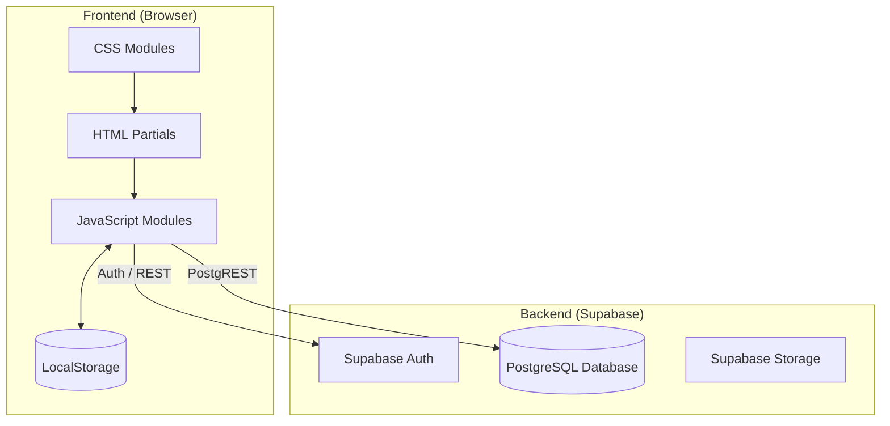

# Technical Proposal

## System Architecture

### Overview

The Internet Shop is a modern web application that follows a client-server architecture. It leverages **Supabase** as a Backend-as-a-Service (BaaS) for authentication and data management, while the frontend is built with vanilla web technologies and enhanced with **HTMX** for dynamic content loading.

### Technology Stack

#### Frontend
- **HTML5**: Semantic markup with partials structure.
- **CSS3**: Modular CSS with global variables and BEM methodology.
- **Vanilla JavaScript (ES6+)**: Core business logic and component management.
- **jQuery**: Used for DOM manipulation and event delegation.
- **HTMX**: Declarative HTML partials loading and dynamic content updates.

#### Backend (Supabase)
- **Authentication**: Email/Password login and registration.
- **Database**: PostgreSQL for storing products, orders, and user data.
- **Client Library**: `@supabase/supabase-js` for direct communication from the browser.

---

### Frontend Architecture

#### HTML & Partials
The application uses a "Partial Loading" strategy. The main pages (`index.html`, `products.html`, etc.) contain the layout, while reusable components are stored in `partials/` and loaded via HTMX.

#### CSS Architecture (BEM)
Styles are organized into component-specific files. All design tokens (colors, spacing, typography) are centralized in `styles/global.css`.
- **Block**: `.product-card`
- **Element**: `.product-card__name`
- **Modifier**: `.product-card--compact`

#### JavaScript Modules
Located in `js/`, each file handles a specific domain:
- `auth.js`: Login, registration, and session management.
- `cart.js`: Shopping cart logic, LocalStorage persistence, and UI rendering.
- `checkout.js`: Order processing and delivery form handling.
- `products.js`: Catalog fetching, filtering, and search.
- `supabase-config.js`: Centralized Supabase client initialization.

---

### Database Schema

#### `products`
Stores the catalog items.
- `id`: UUID (Primary Key)
- `name`, `description`: Text
- `price`: Numeric
- `image_url`: Text
- `sizes`, `colors`: Array of strings

#### `orders` & `order_items`
Stores customer orders and their contents.
- `orders`: Tracks status, total price, and delivery information.
- `order_items`: Links products to orders with specific quantities and sizes.

---

### Data Flow

1. **Authentication**: User logs in via `auth.js` -> Supabase Auth.
2. **Browsing**: `products.js` fetches data from Supabase `products` table.
3. **Cart**: User adds items -> `cart.js` updates LocalStorage and header badge.
4. **Checkout**: 
   - `cart.js` syncs LocalStorage items to Supabase `orders` (draft) and `order_items`.
   - `checkout.js` collects delivery info and updates order status to `paid`.

---

### Security & Performance

- **Row Level Security (RLS)**: Supabase policies ensure users can only access their own orders.
- **Debounced Search**: Search queries are optimized to reduce database load.
- **LocalStorage Fallback**: The shopping cart remains functional even if the user is offline or not logged in (until checkout).
